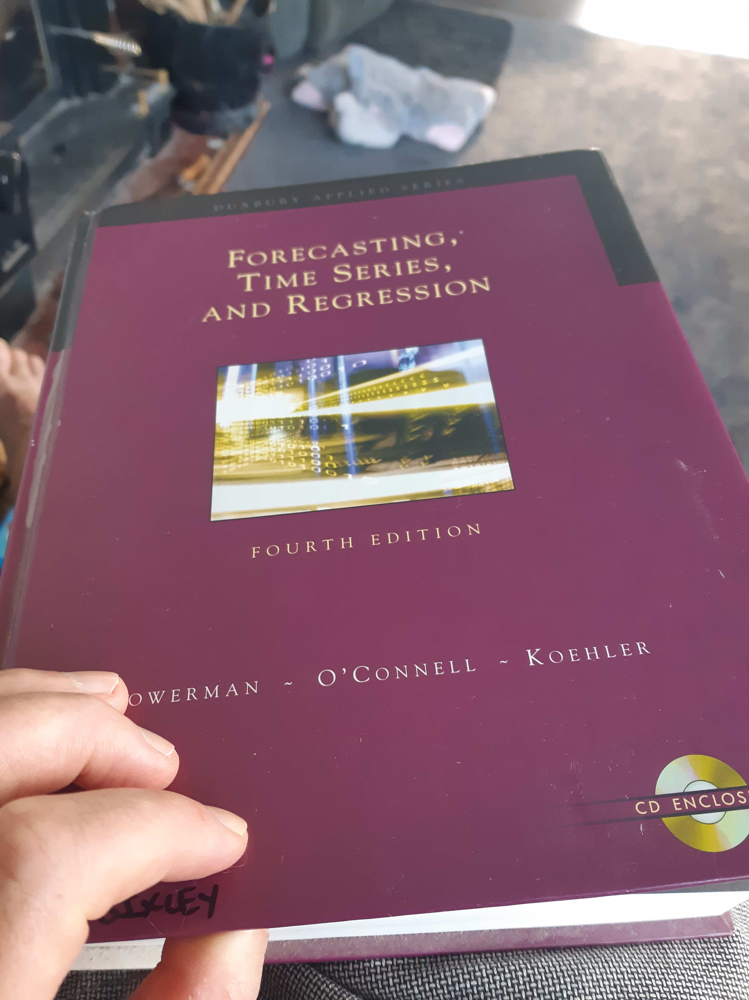
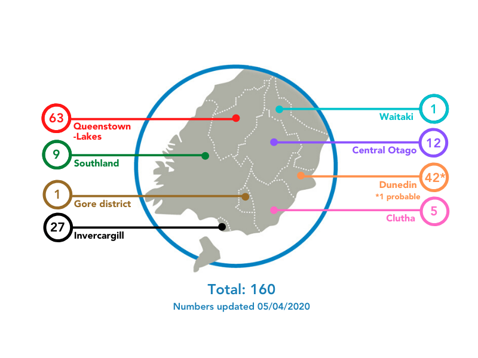

<style>                     
.navbar {
  background-color:silver;
  border-color:black;
}
.navbar-brand {
color:black!important;
font-size: 20px;
}
</style>  

```{r setup, include=FALSE}
#------------------ Packages ------------------
library(flexdashboard)
library(tidyverse)
library(lubridate)
library(scales)
library(ggthemes)

#------------------ Parameters ------------------
# cases today
nzcases = 0
nzdeaths = 19

today = format(Sys.time()-24*60*60, "%Y-%m-%d")
options("scipen"=100, "digits"=6)

# plot themes
mytheme <- theme_classic() + 
  theme(legend.position="bottom") +
  theme(axis.line = element_line(colour = "grey50")) + # plot axis to grey
  theme(panel.grid.major = element_line(colour = "grey40", size = 0.4)) + # grid to grey
  theme(panel.grid.minor = element_line(colour = "grey70", size = 0.3)) + # grid to grey
  theme(panel.grid.major.x = element_blank()) + #remove the vertical grid lines 
  theme(panel.grid.minor.x = element_blank()) #remove the vertical grid lines

# colours
low = "#FFF5EB"
high = "#D94801"
pal_c = "Oranges"
pal_d = "Paired"

#------------------ Data ------------------
#source("code/import_jhu.R")
#source("code/population.R")

# read and tidy the ecdc data
source("code/import_ecdc.R")

# function to add the latest NZ data
source("code/import_nz.R")

# don't run the insert code if it morning, ie ecdc updated overnight
# ifelse(format(Sys.time(), "%H:%M") < "13:00", 
#        covid19,
#        covid19 <- insert_today(nzcases = nzcases, nzdeaths = nzdeaths))

nz <- covid19 %>% filter(country == "New_Zealand")

```

Sidebar {.sidebar data-width=550}
=====================================  

__**The Lockdown Diaries**__

Updates likely 9am NZDT with the over night European data. Just after 1pm NZDT with the New Zealand daily news and sometime in the evening.  

{ width=100% }

**Monday May 4th** (d40)
May the Force be With You

**Monday April 28th** (d33)  
Last day of Level 4 Jail, although I think Level 3 jail will be about the same. I did however discover ReBurger will be open and I WILL partake of that.
My rage with expedia paid off as after two calls and hang ups one by them one by me, my calls were reviewed and indeed I was correct and I have a full refund. Muppets, that is why I rang, because the travel advisory from Qantas was a month old.  
Please may we stay locked up for another month or two. I am happy.

**Sunday April 27th** (d32)  

**Saturday April 25th** (d31)  
After two weeks semi-trying today is my first real effort at trying to cancel flights with expedia, there is a lot of rage currently.

**Friday April 24th** (d30)  
While I may be about to run my 1st 100k week in sometime, I have also been upping the numbers on the scales, FFS. 

**Friday April 17th** (d23)  
Wet day, 2 more cases.

**Thursday April 16th** (d22)  
Losing track of time, no one likes a log log per capita graph cos it shows we should be less restrictive. 3-5 actual cases the last couple of days. How the probables can outstrip the actuals I do not know, but as the actuals go down the probables haven't as much, funny counting????

**Wednesday April 15th** (d21)

**Tuesday April 14th** (d20)  
MOH have messed with their data again and I haven't fixed it. Oh I wish I knew someone who has the data at ESR ;-) Will fix tomorrow.

**Saturday April 11th** (d17)  
Refuse to let the fun police stop me from adventuring, sort of. Set and Orienteering course for the bubble and another boy who lives up around the corner. Day started with Croissants and Pain au Chocolat as well as baking the standard loaf. About to start on Baquettes now.    

**Friday April 10th** (d16)  
Happy Easter - some virtual National Champs Orienteering today, sticking to the rules.  

**Thursday April 9th** (d15) 
Watched too many videos on baking bread, I am about to get obese. Unless it all goes to hell quickly my April 1st predicition that we'd struggle to get to 2000 is coming right nicely.  

**Wednesday April 8th** (d14) 
No idea.  

**Tuesday April 7th** (d13)  
Had a read of Section 70 of the the 1956 Health Act which covers what is legal and not legal. It's not clear if decisions being made and restrictions in place have been made legal or not. It certainly doesn't get reported that changes are legal under xyz act. 

*Part 3  
Infectious and notifiable diseases  
S70 Special powers of medical officer of health*  

**Monday April 6th** (d12)
Painting the Kitchen

**Sunday April 5th** (d11) 
Interesting item on the news about the Swedish approach to lockdown and having more businesses open, so I added their name to a few of the plots. Unless their health system is better able to cope they have a similar status to the UK and not far behind the USA. Certainly way higher cases/capita than do NZ and Australia.  

Kitchen being painted, I busted out my ancient builders skills of using silicone sealant like a pro, because I am a pro. Also tuned my circular saw into a table saw to trim up old Rimu and I still have all my fingers.  

**Saturday April 4th** (d10) 
Curves flattening but not dropping, needs to drop. Back to renovation mode with painting the kitchen. Trying not to cut my fingers off making a chopping board from Rimu extracted from the house.  

**Friday April 3rd** (d9)
Yesterdays update this morning (Saturday). Getting nagged by Greig Hamilton for certain plots to appear. The irony of that coming from him is that I was busy trying to sort out what was happening with the World Rogaining Championships (24 hour Navigation Race) to be held in Tahoe in August. Greig thinks he is quite good (cough cough) having won a couple of world title but hasn't got close to winning the last two NZ Champs which I've set. So for the family that don't know I found myself the President of that World organisation. Just like being head of the IOC, IAAF and FIFA really. Anyway that's cancelled now, so I can make Greigs plots for him.  


**Thursday April 2nd** (d8)  
Sunny day, got really frustrated with the Ministry of Health and their inconsistency with data has shown up.  
Standard run, stremgth and bread making day. Nice run with Ann around the Brockville Loop which mean up Halfway Bush road and return via Frasers Gully. The first part was the commute to Invermay for 10 years on foot.  

[World Rogaine Champs](https://cal-o-fest.com/) not quite postponed yet but lots of back and forth e-mails to the USA encouraging that to be the case.  

**Wednesday April 1st** (d7)  
ECDC and MOH now aligned with an extra dose of cases applied to the ECDC data, which then made me think about applying a 3 day lag to the data as I'd noticed a few discrepencies with Sunday often low and Monday high. Perhaps the text book will let me go back and play with some ARIMA models to have a look.  

Home loop for the run again, this time with an effort and change in music to Rancid and Mighty Mighty Bosstones, which is a bit quicker than Cowboy Junkies were. That was acheived while the Ragu for the Lasgna was maturing and the pasta was resting before being rolled out.  

Time for some predictive modelling me thinks. Rough guess right now, NZ will struggle to get 2000 cases total. Because the lockdown is good and came early. I guess there is still plenty of scope for those who arrived home late to spread their love around.  


**Tuesday March 31st** (d6)  
Thought I was going to be late for work, luckily the daily PE I've been doing made the 5 meter dash from bed-desk an easy task. Much like when I was actually fit and the daily 9.5km commute to Invermay from 6am meant that 120-140k per week was straight forward!!!! Note: the run home was brutal when tired, may have used 'phone a friend' at times.  
Napped, Planks, Kettle Bell Swings and the now standard 30 minute run filled up the afternoon and then dragging out a text book for some light reading.  
  
{ width=70% }  
  
There's a chapter on exponential smoothing but it's not relevant to COVID19. 
Manchild cooked up a delicous Laksa.  

[{ width=20%}](https://github.com/thomasp85/gganimate) didn't work straight off, bugger it.  

**Monday March 30th** (d5)  
Several requests for the plots to be interactive. Just a heads up, Plotly and ggiraph both destory the formatting of what are already ugly plots. I hate them, so you're not getting them. In time I'll get to letting you choose your own countries. Turns out no one is patient though. Can't have much else to do at the moment. Lucky for me I am not very smart and everything takes a long time, like simple formating, google is my friend. 

Home D going well today even if it is wet, still got some strength done and a run along with a solid day of pissing around with data. I don't think I've ever seen so many people looking at so many variations of the same data. I have the prime office desk, adjacent to the fire.


**Sunday March 29th** (d4)  
Home Loop which means Flagstaff with Ann. Stunning day out. Not sure how many times I've done this loop over the years. It's a lot though and when training is my test piece to see how fit I am. 13k with 600m climb, pb around 69 minutes but who knows, I'm older and senile now.   

{ width=100% }


Moved into the extension, tidied up some plots and over plotted NZ for clarity. Still not happy with how they look, will insert some blow ups to see NZ a bit better. Short story, the curve is flattening.  

**Saturday March 28th** (d3)  
Strength, Run, Walk and moved gear into the new walkin wardrobe  
Bullied to share this link.

**Friday March 27th** (d2)  
Got this dashboard underway  
3x1min Boats, 2x1min Russian Twists  
2x1min Supermans each pair  

**Thursday March 26th** (d1)  
Home D - loving it  
PE instituted for the kids (Not Happy)  
3x20 Pushups  
3x10 Squat Jumps  
30 minute run  

**Wednesday March 25th** (d-1)  
Mitre10 for Paint rollers and bits and pieces  
NZDataScience Zoom Morning Tea  
Builders cleaned the windows  
Sparky rigged up the Hotwater Cylinder in the extension (good bastard)  
3x1min Boats  
2x1min Russian Twists  
3x10 Forward Lunges  
30 minute run  

**Tuesday March 24th** (d-2)  
Set up the home office, nipped down to work for a chair  
5x1min Planks  
3x10 Reverse Lunges  
30 minute run  


**Summary**
=======================================================================

Row
-----------------------------------------------------------------------

### confirmed {.value-box}

```{r}
#valueBox(value, subtitle, icon = NULL, color = "aqua", width = 4,href = NULL)
valueBox(
  value = paste0(max(nz$cum_cases, na.rm = T)," / ", nzdeaths),
  caption = "Cases / Deaths",
  icon = "fas fa-user-md",
  color = "silver"
)
```

### active {.value-box}

```{r}
valueBox(
  value = paste0(round(max(nz$per_million, na.rm = T), 1), " / ", round(max(nz$per_million, na.rm = T)/1E6*100, 3), "%"),
  caption = "Cases per million  /  Percent of Population",
  icon = "fas fa-user-md",
  color = "silver"
)
```

### update {.value-box}

```{r}
valueBox(
  value = paste0(format(Sys.time(), "%B %d"),", ",format(Sys.time(), "%H:%M")),
  caption = "Updated",
  icon = "fas fa-clock",
  color = "silver"
)
```

Column
-------------------------------------


### **Notes** 

April 30th - Days since the last case added


April 7th - Added a tab for [**New Zealand DHBs**](#new-zealand), I'm a fan of the Hex Bins created by [Thomas Lumley](https://www.statschat.org.nz/). He is a bit of a guru in the NZ Stats world with some very interesting comments. Many moons ago he gave us a 1 day course in R at AgResearch.

April 6th - the family keep asking for local numbers, they are hard to find in a reproducible way.  
{ width=90% }

April 4th - for the 3rd day in a row the MOH have change the report format of positioning of the table on the webpage!!!!  

April 2nd - ECDC missing yesterdays NZ data, will edit code and grab from MOH from now on.  
EDIT hack to remove NZ from the CDC before adding back in the data as sourced from the MOH, needs work. Aussie and NZ curves following a similar path

March 31st - The ECDC appear to have updated NZ data to match that of the Ministry of Health by applying an extra 40ish cases to the day.  

Modifying the typical plot of cumulative cases per country, either log or raw scale, to adjust for population. Why?  

When comparisons first began, Hubei province and subsequently South Korea, Italy, Spain, Germany and France all have populations of approximtaley 60 Million people and arguably similar standards of living and health care. New Zealand though is an order of magnitude lower and the US nearly an order higher. In simple terms, New Zealand has far less hospital capacity and the US far higher as an absolute value. So absolute values are not interesting, adjusting for population size is. 

There is a discrepency with [MOH](https://www.health.govt.nz/our-work/diseases-and-conditions/covid-19-novel-coronavirus/covid-19-current-situation/covid-19-current-cases) data because for some reason they have decided to report probable cases when no one else does. For consistency the data reverts to that reported by the ECDC overnight.  

The plot shows the log of cases vs cumulative cases, both per capita. All countries follow a similar trajectory, but the goal, with interventions is reduce infectioon by COVID-19. When interventions take effect, with this plot there is a rapid fall in the curve. 

```{r, fiveper, eval = FALSE}
# plot nz growth
#who <- "New Zealand"
who <- c("New_Zealand", "Australia", "USA", "Italy", "China", "South_Korea", "Spain", "France", "Germany", "United_Kingdom")
fiveper <-  covid19 %>% filter(country %in% who, per_million > 5) %>%
  group_by(country) %>% 
  mutate(days5 = dense_rank(date))
fivenz <- fiveper %>% filter(country == "New_Zealand")

p1 <- fiveper %>% 
  ggplot(aes(x = days5, y = per_million, colour = country)) +
  geom_point() +
  geom_line() +
  labs(title = "Per Capita Cumulative Cases",
  subtitle = "days since 5 cases per million",
  x = "Days", y = "Cases\n(per Million People)") +
  scale_y_continuous(breaks = seq(0, 10000, 500)) +
  # overplot NZ
  geom_point(data = fivenz, aes(x = days5, y = per_million, colour = country), size = 3) +
  geom_line(data = fivenz, aes(x = days5, y = per_million, colour = country))

p1 + mytheme + labs(caption = "Source: ECDC") + 
  scale_colour_brewer(palette = pal_d)
```

  
### **Cases**  

```{r, lastcase}
### days since case by dhb
days_since <- nz_moh %>% select(date, DHB) %>% 
  group_by(DHB, date) %>% 
  count() %>% 
  pivot_wider(., names_from = DHB, values_from = n) %>% 
  pivot_longer(-date, names_to = "DHB", values_to = "cases") %>%
  filter(cases > 0) %>% 
  group_by(DHB) %>%
  filter(date == max(date)) %>% 
  mutate(last = as.numeric(today() - date) - 1)

library(DHBins)
p7 <- ggplot(days_since)+
  geom_dhb(aes(fill = last, map_id=dhb_fixname(DHB))) +
  scale_fill_gradient(low = low, high = high, name = "Count") +
  geom_label_dhb(short=F,colour="black") +
  labs(title = "Days since last case", caption = "Source: MOH") +
  theme_void() +
  theme(legend.position="right") +
  theme(title = element_text(size=10, face='bold'))

p7
#```

#```{r, loglog, fig.width=12, fig.height=8, fig.align='center'}
# log log of percapita nz growth
# gganimate, should show fall off in incidence when effective measure take over

who <- c("USA", "Italy", "China", "South_Korea", "Spain", "Sweden", "Germany", "United_Kingdom", "Taiwan", "Singapore")
limit <- 0.005

ausdat <- covid19 %>% filter(country == "Australia", log(cases_million) > limit)
nzdat <- covid19 %>% filter(country == "New_Zealand", log(cases_million) > limit)
plotdata <- covid19 %>% filter(country %in% who, log(cases_million) > limit, population > 4800000)

x <-"per_million"
y <- "cases_million"

p4 <- plotdata %>%
  ggplot(aes(x = per_million, y = cases_million, group = country)) +
  geom_point(col = "grey10", alpha = 0.5) +
  geom_line(col = "grey10", alpha = 0.5) +
  labs(title = "Beating the Curve",
       subtitle = "When restrictions take affect",
       x = "log of Cumulative Cases\n(per Million)", y = "log of Daily Cases\n(per Million)") +
  
  # label the last point
  geom_text(data =  plotdata %>% filter(date == today), 
            aes(label=country),hjust=0, vjust=0, size = 3, colour = "blue") +

  # overplot straya
  geom_point(data = ausdat, aes(x = per_million, y = cases_million), size = 3, colour = "darkgreen", alpha = 0.4) +
  geom_line(data = ausdat, aes(x = per_million, y = cases_million), size = 1.5, colour = "darkgreen", alpha = 0.4) +
  geom_text(data = ausdat %>% filter(date == max(date)), aes(label = country),hjust=0, vjust=0, size = 5, colour = "darkgreen") +
  
  # overplot NZ
  geom_point(data = nzdat, aes(x = per_million, y = cases_million), size = 3, colour = "brown", alpha = 0.7) +
  geom_line(data = nzdat, aes(x = per_million, y = cases_million), size = 1.5, colour = "brown", alpha = 0.7) +
  geom_text(data = nzdat %>% filter(date == max(date)), aes(label = country),hjust=0, vjust=0, size = 5, colour = "brown") +

  
  # log scales
  scale_y_continuous(trans = "log10", breaks = c(0, 1, 10, 100,1000),
                     minor_breaks = c(seq(0,1,0.1),
                                      seq(1,10,1),
                                      seq(10,100,10),
                                      seq(100,1000,100))) +
  scale_x_continuous(trans = "log10", labels = c(0, 10, 100, 1000,10000),
                     breaks = c(0, 10, 100, 1000,10000),
                     minor_breaks = c(seq(0, 10,1),
                                      seq(0, 100, 10),
                                      seq(100, 1000, 100),
                                      seq(1000, 10000, 1000)))

p4 + theme_classic() + 
  theme(legend.position=NULL) +
  theme(axis.line = element_line(colour = "grey50")) + # plot axis to grey
  theme(panel.grid.major = element_line(colour = "grey40", size = 0.4)) + # grid to grey
  theme(panel.grid.minor = element_line(colour = "grey70", size = 0.3)) + # grid to grey
  labs(caption = "Source: ECDC") + theme(legend.position="none")
```

**Plots**
=======================================================================


Column
-------------------------------------


### **Cumulative Cases**
    
```{r, days100}

#----------------------------------------
# Plotting the data
who <- c("New_Zealand", "Australia", "USA", "Italy", "China", "South_Korea", "Spain", "Sweden", "Germany", "United_Kingdom")

dayssince <- covid19 %>% filter(country %in% who , cum_cases > 100) %>%
  group_by(country) %>% 
  mutate(days = dense_rank(date))

daysnz <- dayssince %>% filter(country == "New_Zealand")

p2 <- dayssince %>% 
  ggplot(aes(x = days, y = cum_cases, colour = country)) +
  geom_point() +
  geom_line() +
  geom_point(data = daysnz, aes(x = days, y = cum_cases, colour = country), size = 3) +
  geom_line(data = daysnz, aes(x = days, y = cum_cases, colour = country)) +
  #scale_x_continuous(trans = "log10") +
  scale_y_continuous(trans = "log10", labels = sprintf("%.0f", c(0, 10, 100, 1000,10000,100000,1000000)),
                     breaks = c(0, 10, 100, 1000,10000,100000,1000000),
                     minor_breaks = c(seq(0, 10, 2.5),
                                      seq(0, 100, 25),
                                      seq(100, 1000, 250),
                                      seq(1000, 10000, 2500),
                                      seq(10000, 100000, 25000))) +
  labs(title = "Cumulative Cases", subtitle = "Days since 100 cases",
        x = "Days", y = "Cumulative Cases\n(log10") +
  theme(axis.text.y = element_text(size = 4))

p2 + mytheme + labs(caption = "Source: ECDC") + 
  scale_colour_brewer(palette = pal_d)


```
 
### **Daily Cases**   

```{r, incidence, fig.width=8, fig.height=6, fig.align='center'}
### NZ Cases Barchart
p5 <- covid19 %>% 
  filter(country == "New_Zealand") %>% 
  ggplot(aes(x = date, y = cases)) +
  geom_bar(stat = "identity", fill = high, alpha = 0.8) +
  labs(title = "New Zealand", subtitle = "Cases/Day",
       y = "Cases", x = "Date")

p5 + mytheme + labs(caption = "Source: ECDC") + theme(legend.position="none")


who <- c("New_Zealand", "Australia", "USA", "Italy", "China", "South_Korea", "Spain", "France", "Germany", "United_Kingdom", "Norway", "Sweden")

#who <- covid19 %>% filter(cum_cases > 400) %>% 
#  select(country) %>% 
#  distinct()

#p3 <- covid19 %>% filter(country %in% who$country) %>%
p3 <- covid19 %>% filter(country %in% who) %>%
  ggplot(aes(x = date, y = country, fill = cases_million)) + 
  geom_tile(colour = "white") + 
  scale_fill_gradient(low = low, high = high, 
                      name = "Cases\nper Million") +
  ggtitle("Per Capita Case Incidence") +
  xlab("Days") + ylab("Cases/Million")
 

p3 + mytheme + labs(caption = "Source: ECDC") + 
  theme(panel.grid.major.y = element_blank()) + 
  theme(panel.grid.minor.x = element_blank())

```


**Maps**{.hidden}
=======================================================================

Column {data-width=400}
-------------------------------------

### **World map**


```{r, worldmap}

library(sf)
library(rnaturalearth)
library(rnaturalearthdata)

world <- ne_countries(scale = "medium", returnclass = "sf")

worldcov <- world %>% inner_join(.,covid19, by = c("adm0_a3" = "countryterritoryCode")) %>% 
  filter(per_million < 1500, date == today)

p6 <- ggplot(data = worldcov) +
  labs(title = paste0("Global Cumulative COVID19 at ",today),
       fill = "Cumulative Cases\n(per Million)") +
  geom_sf(aes(fill = per_million)) +
  scale_fill_gradient(low = "#FDD0A2", high = "#D94801")

p6 + mytheme
```

### **European map**

```{r, euromap}
### europe plot

europe <- ne_countries(scale = "medium", returnclass = "sf") %>%
  filter(continent == "Europe")

europecov <- europe %>% inner_join(.,covid19, by = c("adm0_a3" = "countryterritoryCode")) %>% 
  filter(per_million < 6000, date == today)

p7 <- ggplot(data = europecov) +
  labs(title = paste0("European Cumulative COVID19 at ",today),
       fill = "Cumulative Cases\n(per Million)") +
  geom_sf(aes(fill = per_million)) +
  scale_fill_gradient(low = "#FDD0A2", high = "#D94801") +
  coord_sf(xlim = c(-30, 80), ylim = c(35, 85), expand = FALSE) # limits in the sf() object

p7 + mytheme
```

**New Zealand**
=======================================================================

Column {data-width=400}
-------------------------------------

### **Cumulative Cases**

```{r dhb}
#install.packages("DHBins")
library(DHBins)
library(gganimate)
library(transformr)
library(gifski)
library(av)

nz_covid <- nz_moh %>% 
  count(DHB, date) %>% 
  pivot_wider(names_from = date, values_from = n, values_fill = list(n = 0)) %>% 
  pivot_longer(names_to = "date", values_to = "cases", cols = -DHB ) %>% 
  mutate(date = ymd(date)) %>% 
  arrange(DHB, date) %>% 
  group_by(DHB) %>% 
  mutate(cum_case = cumsum(cases)) %>% 
  ungroup()

p <- ggplot(nz_covid)+
  geom_dhb(aes(fill = cum_case, map_id=dhb_fixname(DHB))) +
  scale_fill_gradient(low = low, high = high, name = "Count") +
  geom_label_dhb(short=F,colour="black") +
  labs(title = "Cumulative Cases as at: {nz_covid$date[as.integer(frame)]}", caption = "Source: MOH") +
  theme_void() +
  theme(legend.position="right") +
  theme(title = element_text(size=14, face='bold')) +
  transition_manual(date)

# Video output
animate(
  p + ease_aes('linear'),
  #renderer = av_renderer()
  fps = 5,
  width = 400, height = 600,
  renderer = gifski_renderer(),
  end_pause = 12
)
```

### **Daily Cases**

```{r dhb2}
p2 <- ggplot(nz_covid)+
  geom_dhb(aes(fill = cases, map_id=dhb_fixname(DHB))) +
  scale_fill_gradient(low = low, high = high, name = "Count") +
  geom_label_dhb(short=F,colour="black") +
  labs(title = "Cases per Day: {nz_covid$date[as.integer(frame)]}", caption = "Source: MOH") +
  theme_void() +
  theme(legend.position="right") +
  theme(title = element_text(size=14, face='bold')) +
  transition_manual(date)

# Video output
animate(
  p2 + ease_aes('linear'),
  #renderer = av_renderer()
  fps = 5,
  width = 400, height = 600,
  renderer = gifski_renderer(),
  end_pause = 12
)
```

**About**
=======================================================================

**The Coronavirus Dashboard: the case of New Zealand**

This Coronavirus dashboard provides an overview of the 2019/20 Novel Coronavirus COVID-19 (2019-nCoV) epidemic for New Zealand. This dashboard is built with R using the R Markdown framework with Flexadashboard. Think of it as a living thing, it will change, like the change of going into a minimum of a month long lockdown. The data will not match that presented each day at 1pm (at the moment), there are differences in how data is reported by various sources, perhaps in time I will switch to the [Ministry of Health](https://www.health.govt.nz/our-work/diseases-and-conditions/covid-19-novel-coronavirus) for the New Zealand Data.

note: I have waited longer to share, but Greig Hamilton is impatient. Some of his work that I helped on can be found [here](http://www.rogaine-results.com/) not that he'd ever give me credit for it.

**Code**

The code behind this dashboard is available on [GitHub](https://github.com/mattbixley/covid19){target="_blank"}.

The original layout and first use of data came from [Rami Krispin](https://github.com/RamiKrispin/coronavirus_dashboard){target="_blank"} who created both a dashboard and a package with the Johns Hopkins Data [{ width=3%}](https://github.com/RamiKrispin/coronavirus){target="_blank"}


**Data**

The input data for this dashboard is the dataset available from the
[{ width=3%}](https://www.ecdc.europa.eu/en/publications-data/download-todays-data-geographic-distribution-covid-19-cases-worldwide){target="_blank"} European Centre for Disease Prevention and Control

The data and dashboard are refreshed on a daily basis.

Some data is also pulled from the Johns Hopkins University Center for Systems Science and Engineering (JHU CCSE) Coronavirus [repository](https://github.com/CSSEGISandData/COVID-19){target="_blank"}.
But I find that is late to update due to time zone differences.

**Contact**

For any questions or feedback, you can email me <mattbixley72@gmail.com> or report an issue at the [GitHub repo](https://github.com/MattBixley/COVID19/issues){target="_blank"}

**Update**

The data is as of `r format(max(covid19$date), "%A %B %d, %Y")` and the dashboard has been updated on `r format(Sys.time(), "%A %B %d, %Y")` at `r format(Sys.time(), "%H:%M")`.

