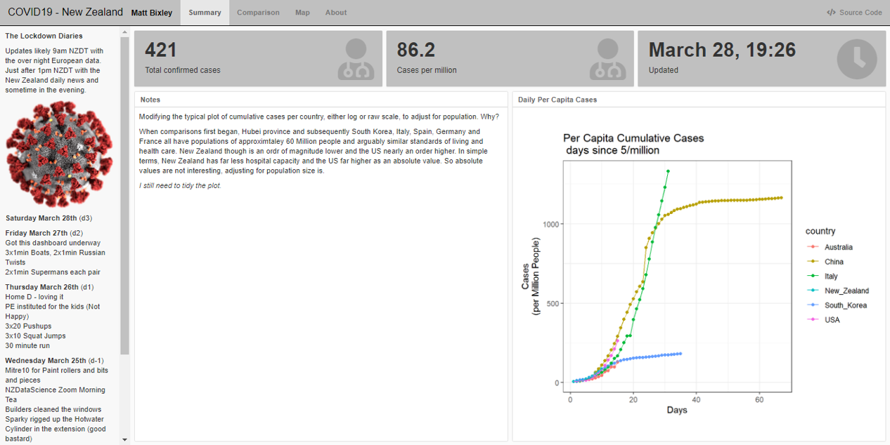

# COVID19
COVID19 Dashboard with emphasis on New Zealand (maybe)

I created this play with dashboard and because I wasn't happy there was nowhere to find per capita analysis. It's now also some sort of Diary of a Lockdown. Check out the **about** page for more information. Updates are likely to come 2 to 3 times a day as various sources update their values and because I'm at home all day, everyday.

example below but open the [current](https://tinyurl.com/nzcovid19) dashboard [here](https://tinyurl.com/nzcovid19)

